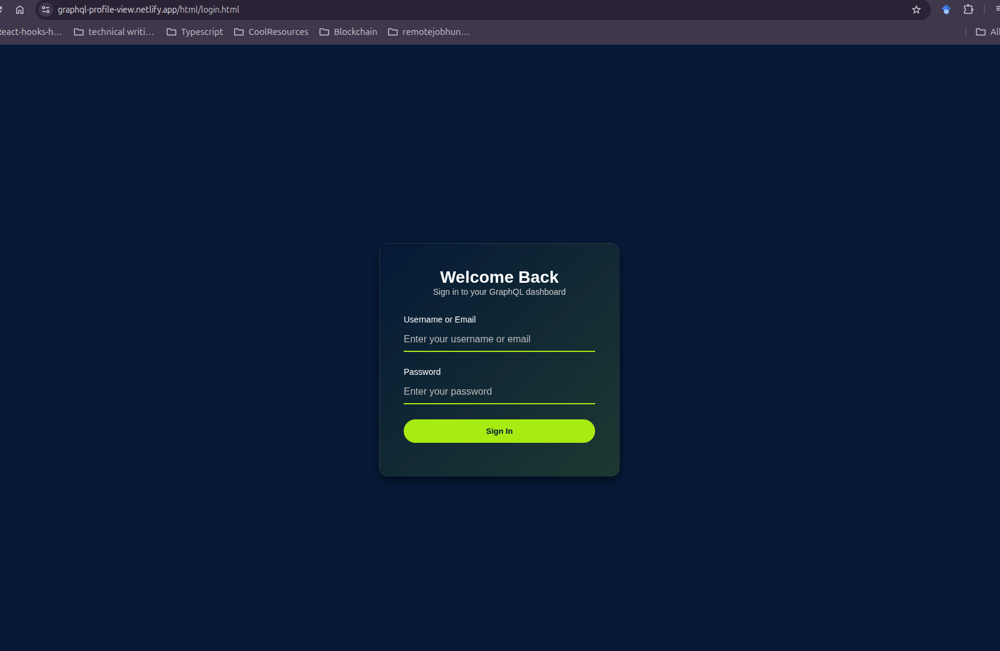

# GraphQL Dashboard

A sleek dashboard for 01-Edu apprentices to track XP, audits, and learning progress, powered by GraphQL .

---

## 🔐 Login Page Preview



> _Screenshot of the login page showing JWT-based authentication UI._

[🌐 View Live Demo on Netlify](https://graphql-profile-view.netlify.app/) 

---
## Features

- **User Authentication:** Secure login using username/email and password, with JWT-based session management.
- **Personalized Dashboard:** Displays user profile, XP, audit statistics, campus info, and recent results.
- **Interactive Graphs:**  
  - **Audit Ratio Graph:** Visualizes audits performed vs. received, with ratio indicators.
  - **XP Progress Graph:** Shows XP accumulation over time (week, month, year).
- **Responsive Design:** Fully responsive and mobile-friendly UI.
- **Modern UI/UX:** Clean, gradient-based design with smooth transitions and feedback.
- **API Integration:** Fetches real-time data from a GraphQL API.

---


## Getting Started

### Prerequisites

- Modern web browser (Chrome, Firefox, Edge, Safari)
- Internet connection (for API access)

### Installation

1. **Clone the repository:**
   ```bash
   git clone https://github.com/Cherrypick14/GraphQL
   cd GraphQL
   ```

2. **Serve the files:**
   - Use any static server (e.g., [Live Server](https://marketplace.visualstudio.com/items?itemName=ritwickdey.LiveServer) for VSCode, or Python's built-in server):
     ```bash
     python3 -m http.server
     ```
   - Open `http://localhost:8000` in your browser.

---

## Usage Guide

### 1. Login

- Navigate to the login page.
- Enter your username/email and password.
- On successful authentication, you'll be redirected to your personalized dashboard.

### 2. Dashboard Overview

- **Profile Section:** Shows your initials, username, and user ID.
- **XP Card:** Displays your total accumulated experience points.
- **Audit Cards:**  
  - *Audits Done:* Number of audits you've performed (with pass/fail breakdown).
  - *Audits Received:* Audits performed on your work (with pass/fail breakdown).
- **Campus Info:** Your campus and join date.
- **Recent Grades/Projects:** Last 5 grades and projects for quick review.
- **Graphs:**  
  - *Audit Ratio:* Compare audits done vs. received, with a ratio indicator.
  - *XP Progress:* Track your XP growth over time (switch between week, month, year).

### 3. Logout

- Click the "Log out" button in the dashboard header to securely end your session.

---

## Technical Overview

### Authentication

- Uses Basic Auth for login (`/api/auth/signin` endpoint).
- JWT is stored in `localStorage` for session persistence.
- All GraphQL requests include the JWT in the `Authorization` header.

### Data Fetching

- User info, XP transactions, grades, audits, and results are fetched via a single GraphQL query.
- Data is processed and rendered dynamically on the dashboard.

### Graphs

- **Audit Ratio Graph:** SVG-based bar chart with gradients, shadows, and ratio indicator.
- **XP Progress Graph:** SVG line/area chart, interactive time period switching, and data point highlights.

### Styling

- Modern, gradient-based design.
- Responsive layouts for desktop and mobile.
- Smooth transitions and hover effects for interactive elements.

---

## Customization

- **API Endpoint:**  
  Update the API URLs in `js/api.js` and `js/login.js` if your backend endpoint differs.
- **Branding:**  
  Modify colors, gradients, and logos in `css/styles.css` to match your organization.
- **Graph Enhancements:**  
  Extend or replace the SVG graph logic in `js/graphs/` for more advanced analytics.

---

## Contributing

Contributions are welcome! Please open issues or submit pull requests for improvements, bug fixes, or new features.

---

## License

[MIT License](LICENSE)  

---